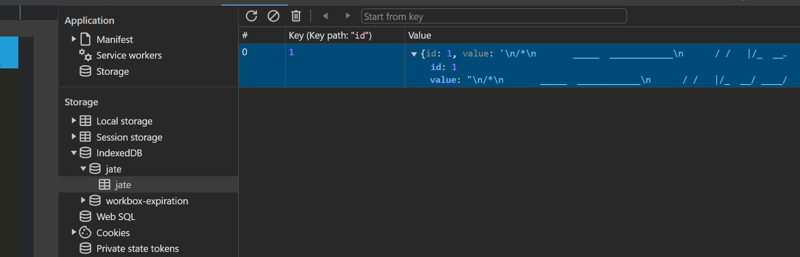

[](https://nodejs.org/en) [](https://www.npmjs.com/) [](https://expressjs.com/) [](https://www.npmjs.com/package/idb) [](https://web.dev/explore/progressive-web-apps) [](https://webpack.js.org/) [](https://codemirror.net/)

<div align="right"> 
<a href= "http://www.wtfpl.net/about/"></a>
</div>

# PWA: Text Editor

This app lets users create notes or code snippets with or without an internet connection.

## Description

This app is a single-page application that meets the Progressive Web Application, `PWA` in short. It also implements several other data persistence techinques which serve as redundancy in case one of the options is not supported by the browser. It can also function offline, which means it will remain fully functional even without an active internet connection through the use of the service worker and page cache techinques. Alos, it runs in the browser as well as as a standalone app after being installed on a computer or on a mobile device.

This app was built using [the starter code](https://github.com/coding-boot-camp/cautious-meme), which uses `CodeMirror`- a code editor component for the web. Meanwhile, it uses `idb` - a lightweight wrapper around the `IndexedDB` database for saving the note or code in the editor.


By creating this project, I learnt the fundamental concept of Progressive Web Application. I learnt to bundle various modules and their dependencies together, generate the bundle, cache the resources in different ways to be retrieved over the network, and make the app installable on devices to run as a standalone app.

## Table of Contents

1. [Installation](#installation)
1. [Usage](#usage)
1. [Licence](#licence)
1. [Screenshots](#screenshots)
1. [Deployed App Link](#dployed-app-link)

## Installation

1. Download and Install the `Node.js`
1. Initialize the project
   ```
   npm init -y
   ```
1. Install `Express` server
   ```
   npm i express
   ```
1. Following are the optional dev dependencies:
   - Install `nodemon` to automatically restart the server everytime code changes
     ```
     npm i -D nodemon
     ```
   - Install `concurrenlty` to run multiple commands concurrenlty
     ```
     npm i -D concurrenlty
     ```

Now, in `Server` level

1. Install `Express` server
   ```
   npm i express
   ```
1. Following are the optional dev dependencies:
   - Install `nodemon` to automatically restart the server everytime code changes
     ```
     npm i -D nodemon
     ```

Then, in `Client` level

1. Install `CodeMirror`
   ```
   npm i code-mirror-themes
   ```
1. Install `idb` IndexedDB database wrapper
   ```
   npm i idb
   ```
1. Following are the optional dev dependencies:

   - Install `babel` to convert ECMAScript 2015+ code into a backwards compatible version of JavaScript in current and older browsers or environments
     ```
     npm i -D @babel/core
     npm i -D @babel/plugin-transform-runtime
     npm i -D @babel/plugin-transform-object-rest-spread
     npm i -D @babel/preset-env
     npm i -D @babel/runtime
     npm i -D babel-loader
     ```
   - Install `css loader` to resolves imports and URLs within CSS files

     ```
     npm i -D css-loader
     ```

   - Install `HTML Webpack plugin` to generate html file in the bundle
     ```
     npm i -D html-webpack-plugin
     ```
   - Install `Style Loader` to inject CSS into the DOM during development, making it faster and more suitable for dynamic updates
     ```
     npm i -D style-loader
     ```
   - Install `Webpack` to transform, bundle, or package JS files, and just about any resource or asset.
     ```
     npm i -D webpack
     npm i -D webpack-cli
     ```
   - Install `Webpack Dev Server` to speed up development by providing a static server with built-in live reload, allowing instant feedback on code changes
     ```
     npm i -D webpack-dev-server
     ```
   - Install `Webpack PWA Manifest` to generate a 'manifest.json' for the PWA app
     ```
     npm i -D webpack-pwa-manifest
     ```
   - Install `Workbox Webpack Plugin` to generate a complete service worker and a list of assets to precache that is injected into a service worker file
     ```
     npm i -D workbox-webpack-plugin
     ```

## Usage

If you wish to use this repo,

- Get a copy of this repo to your local machine
- Install the node module in the root directory
  ```
  npm i
  ```
- Start the app
  ```
  npm run start
  ```
- Open up the `index.html` file genereated in the `dist` folder

## Licence

This app is licensed under [**WTFPL**](http://www.wtfpl.net/about/)

## Screenshots

Screenshot showing the app running as standalone app


Screenshot showing the app's Manifest


Screenshot showing the service worker


Screenshot showing the IndexedDB


Screenshot showing the Cache Storage


Screenshot showing the Lighthouse audit


## Deployed App Link
